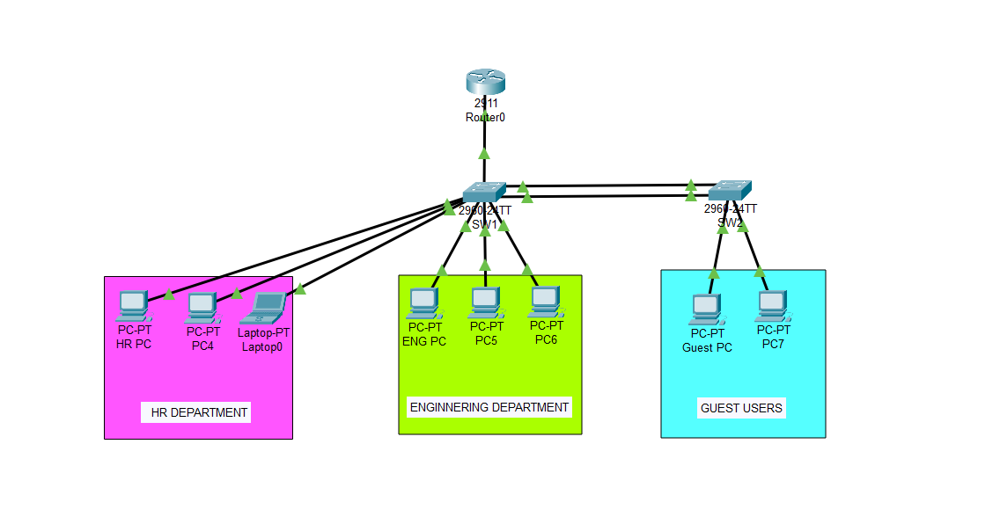

# Project 3 — Redundant Switched Networks & Loop Prevention

## Objective
Add a second switch for redundancy so the network survives hardware failure, prevent 
broadcast storms through STP, and bundle inter-switch cables into one logical 
high-bandwidth link using EtherChannel.

## Topology


---

## What Changed From Project 2
Project 2 left the network secure but fragile — one switch failure meant complete 
outage. Project 3 adds SW2 as backup and bundles inter-switch links for maximum 
efficiency and zero downtime failover.

---

## Part 1 — STP Loop Prevention

Connected two cables between SW1 and SW2 creating redundancy but also a loop risk.
STP ran automatically and blocked one cable to prevent broadcast storms.

### How STP elected SW1 as Root Bridge
- Both switches exchanged BPDUs every 2 seconds
- Both had default priority 32768 — tied
- Tiebreaker was MAC address — SW1 had lower MAC and won
- SW1 became Root Bridge — all its ports set to Designated Forwarding
- SW2 blocked fa0/24 as Alternate port — orange dot in topology

### Manually forced SW1 as permanent Root Bridge
```bash
spanning-tree vlan 1,10,20,30,99 priority 4096
```
Default priority is 32768. Setting 4096 ensures SW1 always wins election regardless 
of what switches are added in future.

### Trunk ports between SW1 and SW2
Configured on both switches:
```bash
interface range fa0/23 - 24
 switchport mode trunk
exit
```

### VLANs added to SW2
```bash
vlan 10
 name HR_Dept
vlan 20
 name Eng_Dept
vlan 30
 name Guest_WiFi
vlan 99
 name BlackHole
exit
```

---

## Part 2 — Guest PCs Moved to SW2

Connected Guest PCs to SW2 fa0/1 and fa0/2 and assigned to VLAN 30:
```bash
interface range fa0/1 - 2
 switchport mode access
 switchport access vlan 30
exit
```

Guest PCs automatically received IPs from existing router DHCP pool — traffic 
traveled up trunk from SW2 to SW1 to router and back. No extra router config needed.

### Port Security on SW2 Guest ports
```bash
interface range fa0/1 - 2
 switchport port-security
 switchport port-security maximum 1
 switchport port-security mac-address sticky
 switchport port-security violation shutdown
exit
```

---

## Part 3 — EtherChannel with LACP

STP was blocking fa0/24 — wasted cable sitting idle. EtherChannel bundles both 
cables into one logical Port Channel interface so both carry traffic simultaneously.

Configured on both SW1 and SW2:
```bash
interface range fa0/23 - 24
 channel-group 1 mode active
exit
interface port-channel 1
 switchport mode trunk
exit
```

### Results after EtherChannel
- Both cables turned green — no more STP blocking
- STP sees only Po1 — one logical interface, no loop detected
- Bandwidth doubled from 100Mbps to 200Mbps
- If one cable fails traffic shifts instantly — zero downtime

---

## Verification Commands
```bash
show spanning-tree
show etherchannel summary
show interfaces port-channel 1
show port-security
show vlan brief
```

---

## Verification Results

**EtherChannel Summary:**
1    Po1(SU)    LACP    Fa0/23(P)    Fa0/24(P)

Both cables bundled, active, running LACP.
**STP before EtherChannel:**
SW2 fa0/23 — Root FWD
SW2 fa0/24 — Altn BLK

**Port Security SW2:**
Fa0/1 — CurrentAddr 1, Violations 0
Fa0/2 — CurrentAddr 1, Violations 0

---

## What I learned
Before this project I never thought about what happens when you plug two cables 
between two switches. Turns out it creates a loop that destroys the entire network 
in seconds through broadcast storms. The fact that STP prevents this automatically 
without any configuration is impressive as switches are constantly talking to each 
other through BPDUs every 2 seconds, silently protecting the network.

EtherChannel was satisfying because it solved two problems at once: eliminated the 
wasted blocked cable and doubled the bandwidth between switches. Watching both cables 
turn green after configuring LACP felt like unlocking the full potential of the 
physical hardware.

## Biggest challenge
Understanding why STP blocks ports on SW2 and not SW1 confused me at first. Once I 
understood that the Root Bridge never blocks its own ports and blocking always happens 
on non-root switches it clicked. SW1 is the boss, it never blocks itself. SW2 is the 
non-root switch so it has to block its redundant path to prevent the loop.
